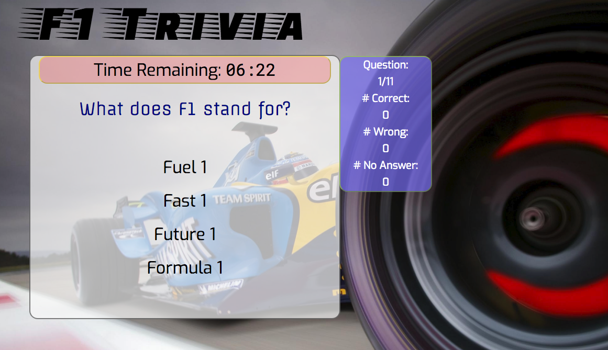
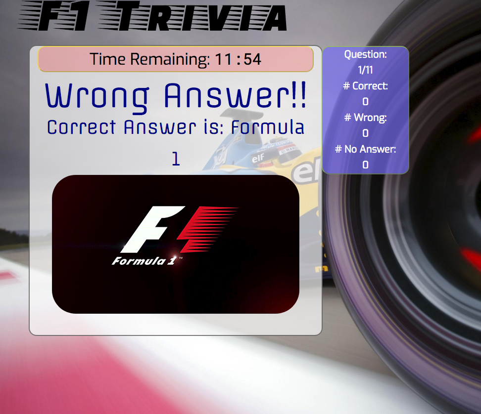

# F1 Trivia Game
This game is based on a well known motor-sport catagory, also considered the most elaborate and popular branch of motor-sports. Each year 11 teams, having two cars and two drivers, compete against eachother to win the dirvers championship as well as the manufacturers champlionship. Most teams are associated with world renown automobile manufacturers (both sports cars and regular cars) such as Honda, BMW, Mercedes and Toyota. Further information can be found at http://www.f1.com.
## Summary
The game tests the basic knowledge of an F1 fan via 11 multiple-choice questions. These questions are asked sequentially and for each question the player is given 15 seconds to respond. A counter on the top right-hand-side of the main question pannel keeps track of the number of questions answered, as well as number of correct, wrong and null responses. Upon completion of the all of the 11 questions, the final results are displayed on the main window for 10 seconds and the player is asked if he/she desires to play one more round to get all questions right.
_____
## The Layout of the game
The game interface is composed of 3 panels and a header. these panels are:
1. Timer Panel
2. Question/answer Panel
3. Status Panel

All the fonts in the game are obtained from **Google Fonts**. The Main panel appears beneath the header. This section is diveded into two parts:
1. the Question section
2. Multiple-choice section

 As the name implies the question section holds the questions. However, this section also serves as the section for information about the game (final results, information on the correctness of the players choice and when needed the correct answers). The multiple-choice section hosts the choices of answers for each questions. After the player makes a slection, this section displays a GIF that has a theme thatis associated with the correct answer. 
 
 The top red box with a yellowish border holds the timer that counts down from 15 seconds for each question. The blue panel to the top right dynamically changes in the begining of each question and displays which question is the player interracting with, how many wrong and correct answers he/she has and how many questions are unanswered due to time running out. 







A "click" sound is also added to the choices. This is setup so that the sound effect plays when any choice is howered over. This functionallyity is added outside the ```f1game``` object near the begining of the ```app.js``` script as a seperate function.
_____
## Game Play (Under the Hood)

The game is composed of mainly 4 stages. These are:
1. Game Start/Restart (with start/restart button)
2. Question display and timer start
3. Evaluate PLayers response and provide appropriate response
4. Kepp track of the number of questions remaining and if all questions asked ask to restart.

### Specs of the Javascript code **app.js**

* Initial game setup is done in a ```$(document).ready``` function, where initia setup ( using``.toggle()`` function) of the hidden Start button and the prompt asking user to clikc the button are displayed. Also here the callback function for the user interraction (for multiple choice) is defined.
*  Entire functionality of the code is throught the Javascript object ```f1game```. This object holds the crutial information on the timing, questions, multiple choices and the correct answers as wll as the important functions that controll the process. 
* Major function attributes that corresponds to the stages described above are:

    Stage 1: ```f1game.askquestion```, ```f1game.startTimer```,```f1game.displayTimer```
    
    Stage 2: ```f1game.evalAns```
    * ```f1game.caseWin```
    * ```f1game.caseLoss```
    * ```f1.game.caseTimeUp```
    
    Stage 3: ```f1game.proceed```, ```f1game.dispOutcome```, ```f1game.statUpdate```,```f1game.resetTimer```
    
    Stage 4: ```f1game.resetAll```
_____
### Flow of the Game
1. The palyer is prompted to click the start button
2. Immediately after Clicking the start butten the question and choice ```<div>``` are toggled on via Jquery ```.toggle()```.
3. The timer initiates as soon as the question is displayed and counts down from 15 seconds. This is set in the ```f1game.TimePerQ``` variable. Also as the time approaches to zero the color of the display changes gradually from black to red. This is controlled via the ```f1game.tmrcolor``` which represent the red color value in RGB for css color property of the timer text.
3. Upon reception of the response of player, the choice of answer is evaluated and the outcome is displayed in question ``<div>``, which is followed by a GIF below. 
4. The display of the GIF as well as the transition form initial screen to the question screen are done via jquerys ``.animate()`` and ``.slideToggle()`` functions. Additional callbacks are added to these functions in order to avoid components being displayed or animated while the containers are olso animated too, which forms a complicated transition view. 
5. The outcome of the response are displayed for 7 seconds, giving enough time to player to enjoy the GIFS. 
6. Steps 3 - 5 are repeated until all the questions depleted
7. When no more questions remaining the status panel (blue panel) is toggled off and results are dsiplayed in the main question `<div>` and choice ``<div>`` is toggled off.  The results contains number of questions (`f1game.questions.length`), number of correct answers (`f1game.nWins`), number of wrong answers (`f1game.nLoss`), number of unanswered questions (`f1game.nNoAns`) and also average time of response to questions which is controlled by the array `f1game.resptimes` that accumulates the ammount of time the player takes to answer the questions. The average is calculated via the followig code in which `.toFixed(2)` ensures the result shown has only two decimal places.

    ``` javascript
    f1game.resptimes.reduce((p,c)=>p+c)/f1game.resptimes.length).toFixed(2)
    ```

8. After displaying results for 10 seconds, this view is replaced with a prompt asking player for more games, in which the start butten is renamed to "restart" and toglled back on. Clicking this button resets all the important variables such as the question counter, win/loss counters. This prepares the process for the nest round, in which the questions are asked again. This process is controlled purely by the question index attribute, ```f1game.currentQIndx```.

